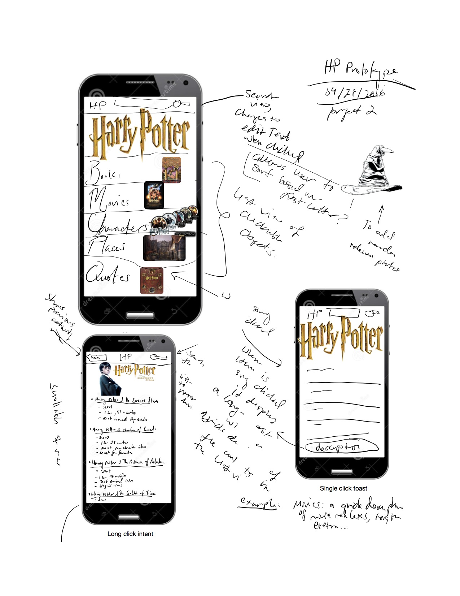
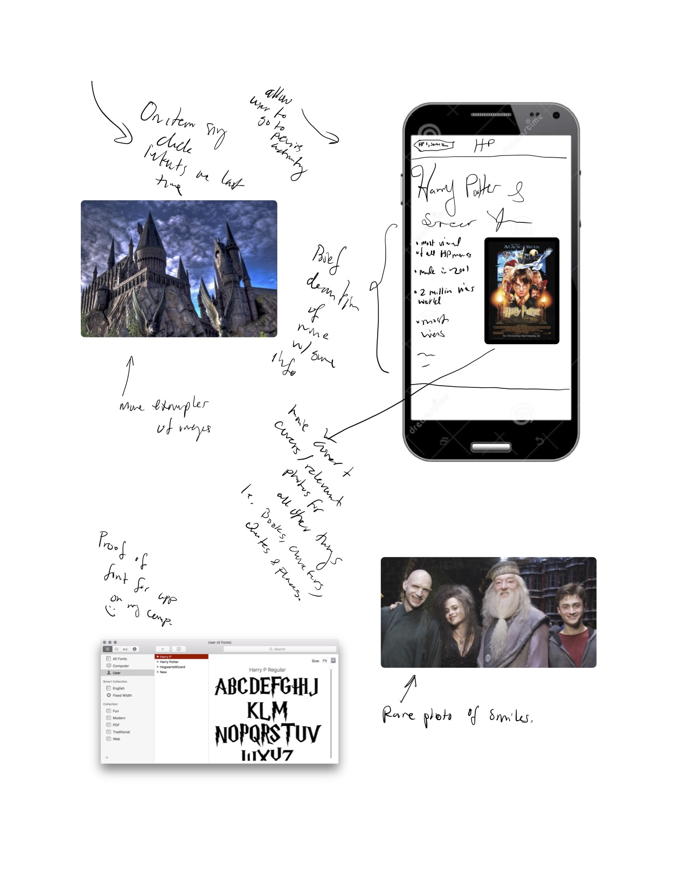
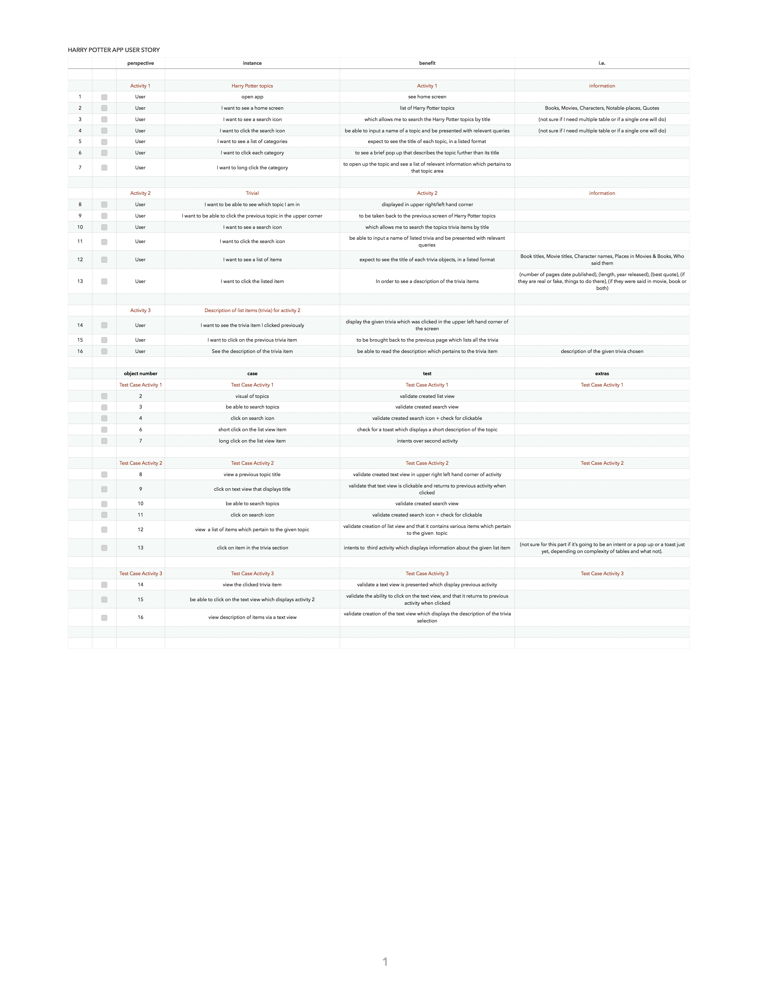
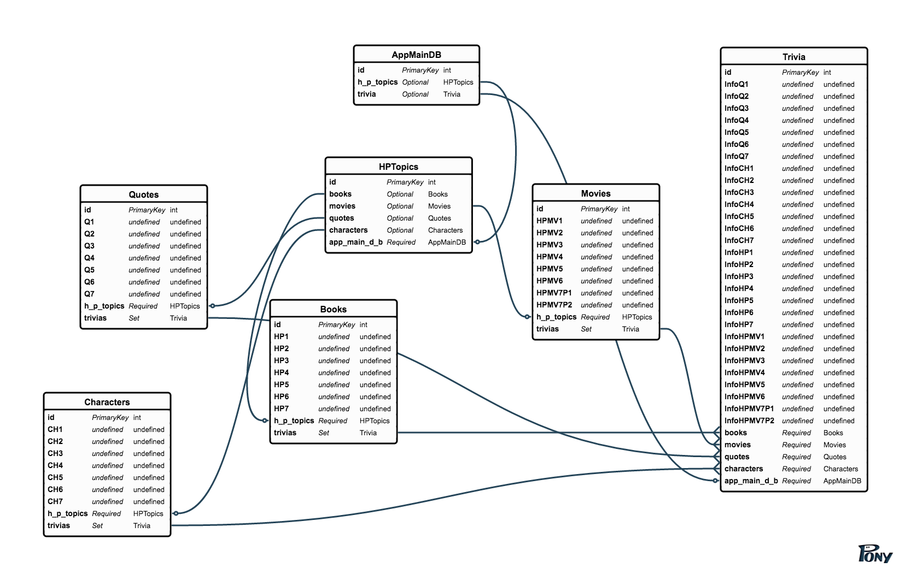

#
#Harry Potter: Project two!
##Your source for everything HP!
##"Everything you'll ever need to know about the wonderful world of Harry Potter"

#**This README consists of a paper prototype, a user story, some manual test cases and an ERD to all help illustrate the app's use case and to better automate the process for me and Project 2.
#Requirements

__Your work must:__

- Have [__user stories__](https://github.com/ga-students/ADI_SM_1/tree/master/work/04-week/07-p2-prep/user-stories),  [__paper prototypes__](https://en.wikipedia.org/wiki/Paper_prototyping),  and an [__ERD__](http://ga-students.github.io/adi_lesson_slides/04-week/db-intro/slideshow.html#1).
- Used __source control__ as [expected for the phase of the program you’re in](https://github.com/ga-students/ADI_SM_1/tree/master/work/04-week/07-p2-prep/git-workflow). 
- Show appropriate use of __comments__, explaining the functionality behind sections of code.
- Be an app that uses a __SQLite__ databse to __store & retrieve__ data locally using technologies and best practices as covered in class 
- __CREATE__ data by __seeding__ the database with meaningful data for use by your app 
- __READ__ data by allowing the user to __search__ by at least three different criteria 
- __Show__ results in separate entries/pages to the user, including descriptions, images, and whatever else you like 
- Include **at least 8** manual test cases in a separate text file & include at least one automated unit test 

__Nice to haves:__

- **Bonus 1**: Allow the user to add __new__ data
- **Bonus 2**: Allow the user to __delete__ data
- **Bonus 3**: Implement __update__ by allowing the user to __favorite__, and later view those favorites 

__Stretch goals:__

- **Bonus**: Create a review system for user feedback at each location (Implement a second model, with relational associations) 
- **Bonus**: Incorporate Material Design principles into your UI 
- **Bonus**: Add more complexity to the user's searches (possibly allowing more than one search criteria at a time) 

##...
#Paper Protype:
#
#
##...
#User story and manual test case:
#
##...
#ERD:

###Below is a ref to the actual database config in SQLite: 

